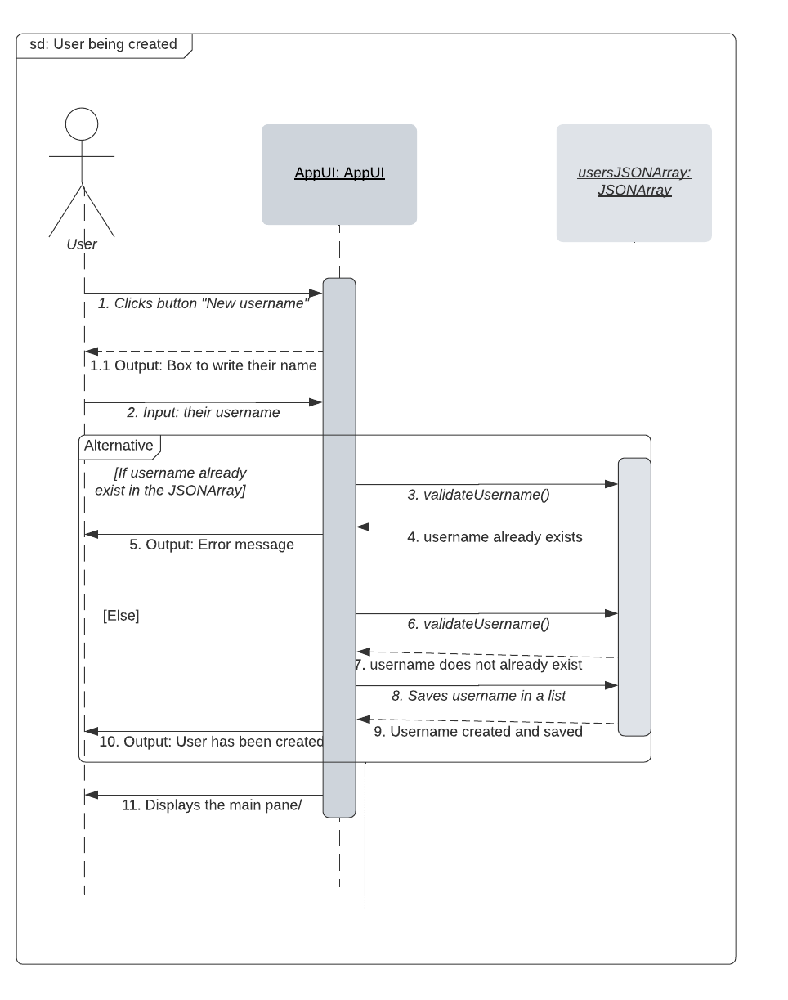
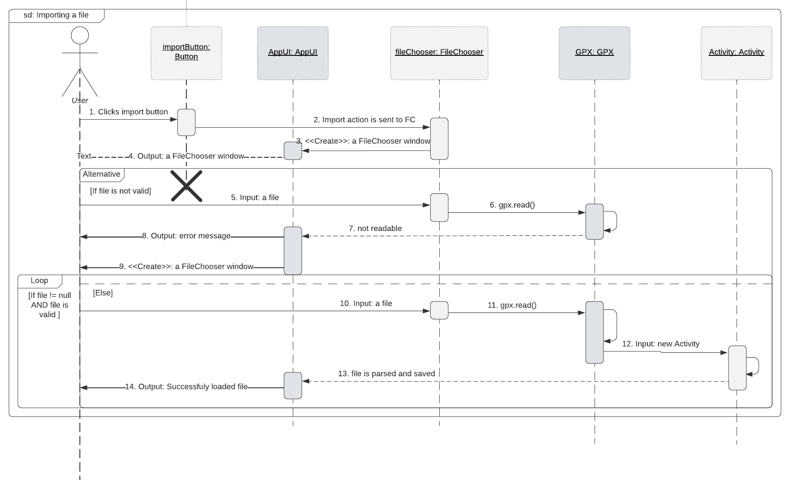
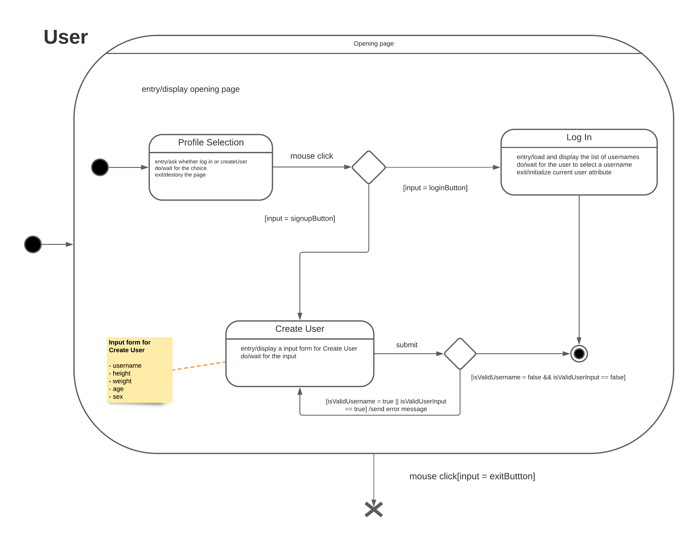
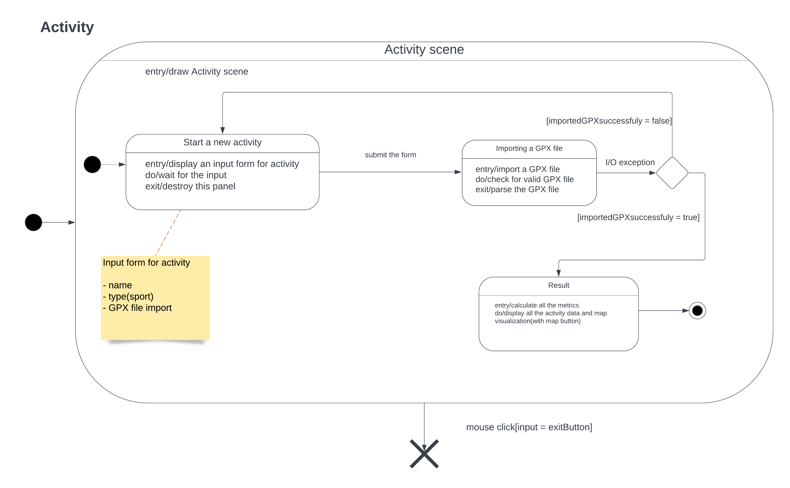

# Routing workout using gpx file
Repository for a Software design project

## Sequence diagrams
<b>Title: Creating a user</b>

What we see happening in the first sequence diagram is a new user being created by the user of the program. He selects the “Create user” button, and is therefore sent to the “create username” pane. Here he writes in his username. 
Behind the scenes, the setName() method takes in his username. After this, we enter the alternative cell, where the AppUI class then checks in the userJSONArray if the username already exists. It also checks if the username is valid. If it already exists and is not a valid username, an error is thrown out. If it does not exist and is valid, the user is created and saved within the userJSONArray. 
Afterwards, the user is told that the username was valid and a username is created. The user is then shown the main pane, already logged into their newly created user. 
 

<b>Title: Importing a GPX file</b>

This sequence diagram starts with the user selecting the “Import” button they are faced with on the main page. The button click sends its signal to the FileChooser class and creates a new instance of the class, a window that lets the user select a file. After this interaction, we enter the alternative cell.

The Button is destroyed at the start of the diagram, illustrating that after it is done being used, it does not matter anymore.
If the file that the user selects is not valid, either the file equals null or it is not a readable GPX file. This results in an error that is thrown to the user. This error also launches a new FileChooser window for the user, giving them a second chance at selecting a file. Given that the file is valid and does not equal null, we enter the loop cell within our alternative cell. The file is then read and parsed. This is illustrated with the arrow after (Number 6), where they go from the same object around and then back to itself again. This loops as many times as possible, until either of the conditions become false. The parsed information is saved within the Activity class with every iteration of the loop, illustrated by (Number 12).

## State machine diagrams

- User

    
    
The figure above illustrates the UML state diagram of the User. The diagram shows how a user initialises the app on the opening page. The app is designed to run with a basic user interface and a user account that associates with the database. Firstly, the app will ask a user whether the user has their own user account or not on the starting panel. So the user must choose either login or create a user account to manipulate the entire system that we implemented before starting an activity or importing a GPX file.

- Activity

    

    The figure above is the UML state diagram of the Activity, which demonstrates the process of how a user creates a new activity along with the app. After the user either logged in or created an account, the user can start off a new activity with a GPX file to compute some metrics related to the selected sporting activity.

## Implementation

We proceeded to create a simple application with a couple of scenes to switch between and a couple of buttons to handle user actions. Starting point was to implement a feature allowing us to import a GPX file into our app in order to process it. We looked at how JavaFX’s class FileChooser could be used to load a file from a stream as well as retrieving its metadata such as, for example, filepath. 

- Location of Main
Main Java class needed for executing our system can be found at: 
[Main.java](./src/main/java/softwaredesign/Main.java)

- Location of Jar
The Jar file for directly executing the system can be found both at: 
[GPXManager.jar](./out/artifacts/GPXManager.jar)
 or in the root of the project.

<b>NOTE:</b> application will create additional files on your computer. It includes: creating a data folder in the directory containing JAR file (or in build/classes/java in case the system’s entry point is Main.java) and any data created inside of this folder. It is vital for applications to work properly, since all user data and activities have to be stored somewhere. It might not work on all operating systems, since it was only tested on Windows 10 ver. 10.0.19044 Build 19044 and Windows 11 ver. 10.0.22000.

Test GPX files can be found at: [gpx_examples](./gpx_examples).

Demo video can be found [here](https://drive.google.com/file/d/1gUGtxb8nQ0-vUzYGAgf5db_REJi7NNmU/view).

